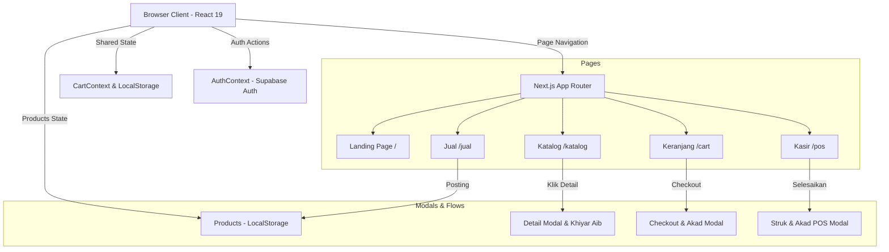

# ARCHITECTURE.md — Arsitektur Sistem RELOOP Shop

Dokumen ini menjelaskan struktur teknis, arsitektur data, komponen, dan alur integrasi aplikasi RELOOP Shop.

---

## 🏛️ Arsitektur Sistem

Aplikasi ini menggunakan pola **Jamstack Modern** dengan struktur **Next.js App Router**:



---

## 📂 Struktur Direktori

Struktur file project dirancang modular untuk memisahkan logika halaman (*pages*), komponen UI (*components*), manajemen status (*state/context*), dan integrasi library eksternal (*lib*):

* **`src/app/`**: Folder inti Next.js App Router yang mendefinisikan rute halaman dan layout.
  * **`page.js`**: Halaman beranda utama dengan estetika Cream & Maroon yang mengenalkan nilai keberlanjutan dan kehalalan belanja.
  * **`katalog/page.jsx`**: Menampilkan produk terdaftar beserta status cacat dan thaharah-nya (mengambil data dari LocalStorage `reloop_products`), terintegrasi dengan modal detail syariah.
  * **`jual/page.jsx`**: Halaman pengunggahan barang jualan oleh mitra/pengguna. Memproses input data produk, konversi file foto pakaian menjadi **Base64 Data URL**, deklarasi tingkat kecacatan produk secara jujur, serta jaminan thaharah.
  * **`cart/page.jsx`**: Mengelola visualisasi keranjang belanja, proses input data pembeli, peninjauan defect, dan alur Ijab Qobul digital.
  * **`pos/page.jsx`**: Dasbor kasir offline untuk merekam produk kustom, status kesucian, persetujuan verbal pembeli, dan mencetak nota fisik syariah.
  * **`globals.css`**: Deklarasi global CSS Tailwind v4, termasuk variable tema Cream (`#FAF5EE`) dan Maroon (`#7D1D2E`).
* **`src/components/`**: Komponen visual reusable.
  * **`Navbar.jsx`**: Menu navigasi global dengan pembacaan real-time dari `CartContext` untuk menampilkan jumlah barang di keranjang belanja.
* **`src/context/`**: Manajemen status global (*global state management*).
  * **`AuthContext.jsx`**: Integrasi otentikasi Supabase (Login, Register, Sign Out) untuk melacak sesi aktif pengguna.
  * **`CartContext.jsx`**: Manajemen state keranjang belanja yang persisten menggunakan LocalStorage browser (menghindari hilangnya data saat halaman dimuat ulang).
* **`src/lib/`**: Konfigurasi client Supabase.
  * **`supabase.js`**: Inisialisasi SDK Supabase menggunakan variabel lingkungan.

---

## 💾 Manajemen State & Alur Data

### 1. Siklus Data Keranjang (`CartContext`)
* Ketika pengguna menekan **"Beli & Masuk Keranjang"** pada modal katalog:
  1. Fungsi `addToCart` dipanggil dengan objek produk.
  2. State `cartItems` diperbarui dengan menambahkan item baru atau menaikkan jumlah (`qty`) jika produk yang sama sudah ada.
  3. Perubahan memicu efek samping (`useEffect`) untuk menyinkronkan data terbaru ke `localStorage` dengan key `"reloop_cart"`.
  4. Komponen `Navbar` menerima pembaruan state secara langsung dan memperbarui badge angka keranjang belanja.

### 2. Alur Checkout Akad Syariah
* Pada halaman `/cart`, proses checkout tidak langsung memotong pembayaran atau mengirim data ke API, melainkan meluncurkan *Akad Wizard Modal* dengan tahapan:
  ```
  [Keranjang Belanja] 
         │
         ▼ (Klik Lanjutkan ke Akad)
  [Tahap 1: Konfirmasi Cacat]  ──► Pembeli memeriksa ulasan defect pakaian & centang kotak setuju.
         │
         ▼ (Klik Lanjut ke Akad)
  [Tahap 2: Akad Musawamah]    ──► Input nama pembeli & centang kotak QOBUL (Pernyataan Ijab Qobul).
         │
         ▼ (Klik Selesaikan Akad)
  [Tahap 3: Penerbitan Sertifikat] ──► Menampilkan sertifikat digital syariah & mengosongkan keranjang belanja.
  ```

---

## 🗄️ Skema Database (Rekomendasi Migrasi Masa Depan)

Apabila aplikasi dihubungkan dengan database relasional (seperti PostgreSQL Supabase), berikut adalah usulan struktur tabel yang dirancang untuk mendukung fungsionalitas kepatuhan syariah:

### 1. Tabel `products`
Menyimpan data pakaian vintage beserta tingkat kecacatannya dan status thaharah.
```sql
CREATE TABLE products (
    id UUID PRIMARY KEY DEFAULT gen_random_uuid(),
    name VARCHAR(255) NOT NULL,
    category VARCHAR(100) NOT NULL,
    price NUMERIC(12, 2) NOT NULL,
    size VARCHAR(20) NOT NULL,
    condition VARCHAR(50) NOT NULL, -- e.g., 'Sangat Baik', 'Baik'
    era VARCHAR(50),                -- e.g., '1990s'
    defect_grade VARCHAR(50) NOT NULL DEFAULT 'Tidak Ada', -- 'Tidak Ada', 'Ringan', 'Sedang', 'Berat'
    defect_desc TEXT,               -- Uraian kecacatan produk secara transparan
    purification_status VARCHAR(255), -- Catatan metode sterilisasi/pensucian
    is_purified BOOLEAN DEFAULT TRUE,
    created_at TIMESTAMP WITH TIME ZONE DEFAULT CURRENT_TIMESTAMP
);
```

### 2. Tabel `orders`
Menyimpan riwayat pembelian online lengkap dengan rincian hukum akad perdagangan yang digunakan.
```sql
CREATE TABLE orders (
    id UUID PRIMARY KEY DEFAULT gen_random_uuid(),
    order_number VARCHAR(100) UNIQUE NOT NULL,
    buyer_name VARCHAR(255) NOT NULL,
    user_id UUID REFERENCES auth.users(id) ON DELETE SET NULL,
    subtotal NUMERIC(12, 2) NOT NULL,
    discount NUMERIC(12, 2) DEFAULT 0.00,
    total NUMERIC(12, 2) NOT NULL,
    akad_type VARCHAR(100) NOT NULL DEFAULT 'Bai Al-Musawamah',
    akad_accepted_at TIMESTAMP WITH TIME ZONE NOT NULL,
    khiyar_expire_at TIMESTAMP WITH TIME ZONE NOT NULL, -- Tanggal jatuh tempo khiyar aib (H+3 hari)
    status VARCHAR(50) NOT NULL DEFAULT 'Paid',
    created_at TIMESTAMP WITH TIME ZONE DEFAULT CURRENT_TIMESTAMP
);
```

### 3. Tabel `order_items`
Menghubungkan pesanan dengan produk yang dibeli beserta salinan deskripsi cacat saat transaksi dilakukan.
```sql
CREATE TABLE order_items (
    id UUID PRIMARY KEY DEFAULT gen_random_uuid(),
    order_id UUID REFERENCES orders(id) ON DELETE CASCADE,
    product_id UUID REFERENCES products(id) ON DELETE SET NULL,
    product_name VARCHAR(255) NOT NULL,
    price NUMERIC(12, 2) NOT NULL,
    qty INT NOT NULL CHECK (qty > 0),
    defect_desc_at_sale TEXT -- Menyimpan deskripsi defect saat dibeli untuk bukti jika ada sengketa khiyar aib
);
```
